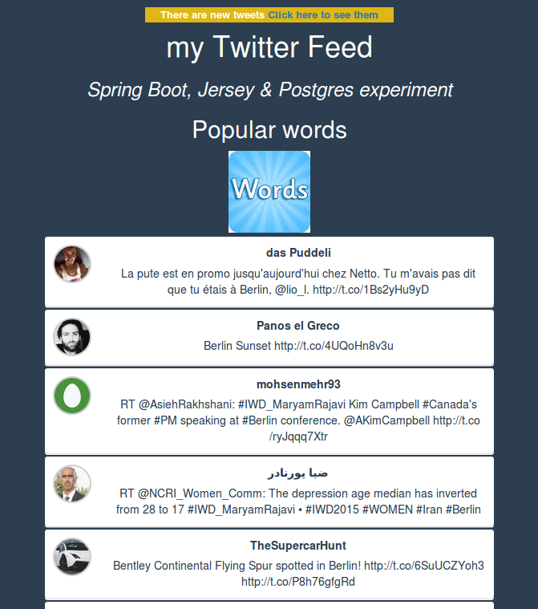
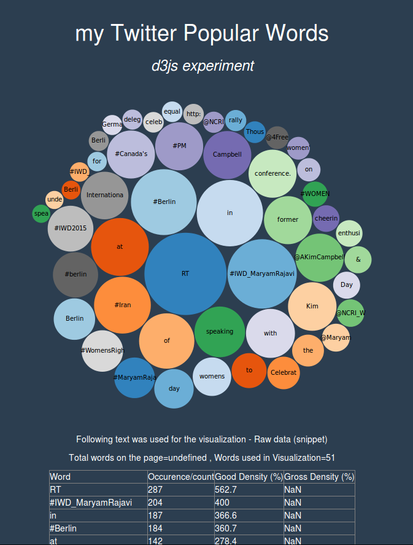

Twitter Feed
=============================================

## Introduction

The main functionality offered by this project is a local Twitter feed.

The purpose of the project is to make some experimentation with twitter feeds in order to get an idea on how to
structure the tweets in order to make them available in a timely fashion when their number grows.

Tweets are imported via a too directly from Twitter API (via twitter4j-stream) and stored in a Postgres database.
A REST webservice delivers on request the tweets to the web server or (via JSONP) to AJAX handlers in the web UI.

Since there is currently not much logic within the project, it can be used as a tutorial for spring-boot MVC or
spring-boot jersey REST.

Once the tweets are imported in Postgres, their words get counted and they get added into redis sorted sets for
building a statistic of the most frequent words used in the tweets in the last few minutes.
For displaying the statistic of the most popular words, d3js library is being used.

Screenshots of the web application are available below :

DISCLOSURE : The web UI is using a great deal of code adapted from from this tutorial project :

https://github.com/scotch-io/react-tweets

## Frameworks

There are different frameworks which are used within the project. In the lines below these frameworks and the purpose
for which they are used are enumerated.

### spring-boot

spring-boot-starter-jersey is used for delivering webservice functionality in the project service
In order to enable the Javascript client to receive directly the flow of tweets, there is JSONP functionality exposed
by the webservices.

spring-boot-starter-web and spring-boot-starter-thymeleaf frameworks are used for delivering web MVC functionality in
the project web.

spring-boot uses an embedded version of Tomcat 8 which makes the development & testing part quite fast in comparison
to the times when Tomcat was used in a different process.

### twitter4j

twitter4j-stream library is used in order to import the tweets from Twitter API.

### perf4j

The webservice calls are profiled in order to have a clear idea on how much time is spent for handling each REST
request in the project service.

### jquery

The javascript functionality on the web UI client side is implemented by using this library.

### jedis
The redis client library is used for interacting with the redis server in building the statistics of the most
frequent words in the last 5 minutes.
