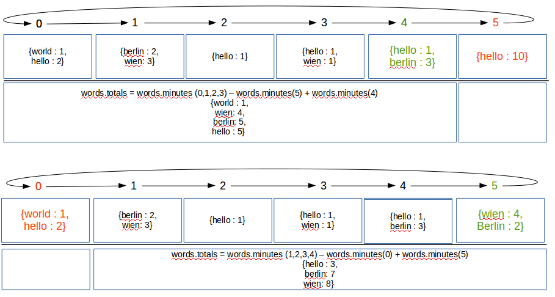

Count tweets words job
========================================================

## Introduction

This batch job fills into Redis sorted set all the tweet words from the last five minutes in order to have be able to
 build a statistic of the most used words within the imported tweets in the system.

Inspiration for this feature came out from the answer to the Stackoverflow question :

http://stackoverflow.com/questions/10189685/realtime-tracking-of-top-100-twitter-words-per-min-hour-day

## Technical details

Considering that the statistic needs to hold only the words belonging to the tweets introduced into the system in the
last 5 (N) minutes (words.minutes.1, words.minutes.2 ... words.minutes.6), the technical solution for the problem is to
have 6 (N+1) Redis sorted sets for storing word statistics per minute and another Redis sorted set to store the
totals for the last 5 (N) minutes (words.totals).
During each minute,the sorted set corresponding to the current minute will be filled with new statistics. At the
beginning of each minute, all the statistics (word, count) contained in the sorted set corresponding for the next
minute will be subtracted from the sorted set containing the totals and subsequently this minute sorted set will be
emptied (by deleting it).

In this manner, the words.totals statistic will always contain the words filled within the last four minutes and the
current minute.

In order to easier grasp the way how the job works a simple visual representation is presented below :

